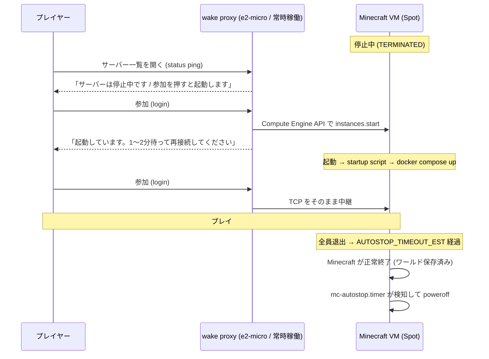

# アイドル時の自動停止と wake proxy

- 更新日: 2026-09-13
- 対象: [改善調査レポート](improvement-review.md) の **B. 最大の削減幅: アイドル時の自動停止**

## 変更の要点

誰も接続していない間 Minecraft VM を止め、プレイヤーが「参加」を押したら自動で起こす。

| | 変更前 | 変更後 |
| --- | --- | --- |
| Minecraft VM | 24/7 稼働 | プレイ中だけ稼働（アイドルで自動停止） |
| 停止のきっかけ | なし | itzg の `ENABLE_AUTOSTOP` + `mc-autostop.timer` |
| 起動のきっかけ | 手動 | 常時稼働の **wake proxy** がプレイヤーの参加操作を検知して起動 |
| プレイヤーの接続先 | Minecraft VM の外部 IP（起動のたびに変わる） | wake proxy の外部 IP（**固定**） |
| 公開ポート | Minecraft VM の 25565 | wake proxy の 25565 のみ（Minecraft VM 側はサブネット内からのみ） |

## 仕組み



### 停止側

1. **itzg の Auto-Stop**（`ENABLE_AUTOSTOP`）が、最後のプレイヤーが抜けてから
   `AUTOSTOP_TIMEOUT_EST` 秒後にサーバーを正常終了させる。
   起動後に誰も来なければ `AUTOSTOP_TIMEOUT_INIT` 秒で終了する。
2. これだけでは **コンテナが止まるだけで VM は課金され続ける**ので、
   `mc-autostop.timer`（1 分おき）がコンテナの終了を検知して `systemctl poweroff` する。
   GCE では guest からの poweroff はインスタンスの停止（TERMINATED）になり、ディスクは保持される。

コンテナが自分で終了する必要があるため、`minecraft` サービスの
`restart` ポリシーは `unless-stopped` から **`no`** に変えている
（`unless-stopped` のままだと Docker が即座に再起動して永久に止まらない）。

> Auto-Stop と Auto-Pause は排他。両方を有効にしてはいけない。

### 起動側 (wake proxy)

`google/compute_engine/files/wake-proxy.py`。Python 標準ライブラリのみで書かれた
小さな TCP プロキシで、常時稼働の e2-micro 上で systemd サービスとして動く。

| Minecraft VM の状態 | ステータス ping | 参加 (login) |
| --- | --- | --- |
| 起動中 | 実サーバーへ中継 | 実サーバーへ中継 |
| 停止中 | 「停止中」の MOTD を返す | `instances.start` を叩き、案内メッセージを出して切断 |

- クライアントが名乗ったプロトコル版をそのまま返すので、サーバー一覧では
  バージョン不一致（赤い×）ではなく通常表示になり、MOTD が読める。
- ステータス ping では起動しない。**参加を押したときだけ**起動する
  （サーバー一覧を開くたびに起動してしまうのを避けるため）。
- 起動要求は `wake_proxy_start_cooldown` 秒（既定 120）と
  インスタンス状態の確認で多重化を防いでいる。

権限は `mc-wake-proxy` サービスアカウントに、**mc-server インスタンス 1 台に対してだけ**
`roles/compute.instanceAdmin.v1` を付けている（プロジェクト全体ではない）。
サービスアカウント付きの VM を起動するには `actAs` が要るため、
`mc-server` サービスアカウントに対する `roles/iam.serviceAccountUser` も併せて付与している。

### 副次的な効果: Spot のプリエンプション復帰

Spot VM がプリエンプトされて停止した場合も、次に誰かが参加しようとした時点で
wake proxy が起こす。これまでは手動で起こす必要があった。

## プレイヤー向けの手順

1. サーバーアドレスは `terraform output minecraft_connect_address` の値。**一度登録すれば変わらない**。
2. サーバーが寝ているときは一覧に「サーバーは停止中です」と出る。
3. 「参加」を押すと「起動しています」と表示されて切断される。**これは正常**。
4. 1〜2 分待ってもう一度参加する。

`discord_webhook_url` を設定していれば、起動完了時に Discord へ通知が飛ぶ。

## コストへの効果

改善調査レポートの概算（`n2-standard-4` Spot ≈ $48/月）を基準にした場合:

| 項目 | 変更前 | 変更後（1 日 4 時間プレイ） |
| --- | --- | --- |
| Minecraft VM | ~$48 | **~$8** |
| wake proxy (e2-micro) | — | $0（対象リージョンの無料枠 1 台に収まる想定） |
| 外部 IP | Minecraft VM に 1 つ | wake proxy に 1 つ（Minecraft VM は停止中は課金なし） |
| ディスク | boot 10 + data 10 = 20GB | + proxy boot 10GB = 30GB |

削減率はプレイ時間に比例する。1 日 4 時間なら compute は約 1/6。

> **確認してほしいこと**
> - 無料枠（e2-micro 1 台 / 標準 PD 30GB / 北米下り 1GB）は請求先アカウント単位。
>   標準 PD は 30GB ちょうどなので、他に標準 PD を使っていると超過する。
> - 実際の削減幅は請求レポートで確認すること。ここの数字は調査レポートの概算の延長。

## 設定

`deploy/terraform.tfvars` で変更する。既定値のままで動く。

| 変数 | 既定 | 説明 |
| --- | --- | --- |
| `enable_autostop` | `true` | アイドル自動停止そのもの。`false` で従来の 24/7 稼働に戻る |
| `autostop_timeout_est` | `1200` | 最後の 1 人が抜けてから停止するまでの秒数 |
| `autostop_timeout_init` | `900` | 起動後、誰も来ないまま停止するまでの秒数 |
| `enable_wake_proxy` | `true` | wake proxy VM を建てるか |
| `wake_proxy_machine_type` | `e2-micro` | 無料枠の対象は e2-micro のみ |
| `wake_proxy_start_cooldown` | `120` | 起動要求のクールダウン秒数 |
| `wake_proxy_install_ops_agent` | `true` | wake proxy のログを Cloud Logging に送るか |
| `backup_interval` | `2h` | mc-backup の間隔（下記参照） |
| `prune_backups_days` | `7` | バックアップの保持日数 |
| `discord_webhook_url` | `""` | 起動通知の送り先。空なら通知しない |

### バックアップ間隔を縮めた理由

24/7 稼働でなくなったことで、mc-backup の既定（24 時間間隔）だと
**1 回のプレイセッション中に一度もバックアップが走らない**。
稼働時間に合わせて `2h` にし、ディスクを溢れさせないよう `PRUNE_BACKUPS_DAYS` も明示した。

> バックアップがワールドと同じディスクに載っている問題は未解決。
> 改善調査レポートの **F（GCS へのバックアップ）** で扱う。

## 運用

```bash
terraform -chdir=deploy output minecraft_connect_address
```

```bash
gcloud compute instances start mc-server --zone us-central1-a
```

```bash
gcloud compute instances stop mc-server --zone us-central1-a
```

wake proxy のログ（起動要求の記録）:

```bash
gcloud logging read 'logName=~"wake_proxy"' --limit 20 --project minecraft-482506
```

SSH で直接見る場合:

```bash
gcloud compute ssh mc-wake-proxy --zone us-central1-a --tunnel-through-iap --command 'sudo tail -50 /var/log/mc-wake-proxy.log'
```

自動停止の記録（Minecraft VM 側）:

```bash
gcloud compute ssh mc-server --zone us-central1-a --tunnel-through-iap --command 'journalctl -t mc-autostop -n 50'
```

### 初回 apply 後に確認すること

1. `terraform output minecraft_connect_address` が wake proxy の IP になっている
2. Minecraft VM を止めて、クライアントのサーバー一覧に「サーバーは停止中です」が出る

   ```bash
   gcloud compute instances stop mc-server --zone us-central1-a
   ```

3. 「参加」を押すと案内が出て切断され、**1〜2 分後に VM が RUNNING になっている**

   ```bash
   gcloud compute instances describe mc-server --zone us-central1-a --format='value(status)'
   ```

4. 20 分ほど誰も繋がないでいると、VM が自動で TERMINATED に戻る

3 で起動しない場合は wake proxy のログに権限エラーが出ている。

```bash
gcloud compute ssh mc-wake-proxy --zone us-central1-a --tunnel-through-iap --command 'sudo tail -50 /var/log/mc-wake-proxy.log'
```

`instances.start` はインスタンス単位の IAM（`roles/compute.instanceAdmin.v1` を
mc-server インスタンスにだけ付与）で通す設計だが、環境によってはプロジェクト単位の
付与が必要になることがある。その場合は `google_compute_instance_iam_member` を
`google_project_iam_member` に変える。

### 一時的に止めたくない場合

サーバー内の `/data/.skip-stop` があると Auto-Stop はタイマーをリセットして停止しない。

```bash
gcloud compute ssh mc-server --zone us-central1-a --tunnel-through-iap --command 'sudo touch /mnt/minecraft/server/.skip-stop'
```

## 注意点・既知の制限

- **起動には 1〜2 分かかる。** Mod 60 件の NeoForge サーバーなので、VM の起動 +
  `docker compose up` + Mod 読み込みでこの程度は避けられない。
  Minecraft クライアントの接続タイムアウトは 30 秒なので、待たせる方式ではなく
  「案内を出して切断 → 再接続」にしている。
- **Docker の再インストールをスキップするようにした。** 起動のたびに Docker を
  入れ直していると数分余計にかかるため、`command -v docker` でガードした
  （調査レポート 3-7）。ブートディスクは stop/start でも preemption でも保持される。
- **wake proxy が落ちると誰も接続できない。** systemd の `Restart=always` で復帰するが、
  プロキシ VM 自体が落ちた場合は `gcloud compute instances start mc-wake-proxy` が必要。
- **ゲームのトラフィックは wake proxy を経由する。** e2-micro（共有 vCPU）を通るため、
  多人数・高トラフィックだとここがボトルネックになりうる。数人規模を想定した構成。
- **`discord_webhook_url` はインスタンスメタデータに平文で載る。**
  RCON パスワードと同じ問題で、調査レポートの **3-3** で扱う。
- **Minecraft VM の 25565 は外部から直接叩けなくなる**（`enable_wake_proxy = true` のとき）。
  切り分けのために直接繋ぎたい場合は `enable_wake_proxy = false` にするか、
  一時的にファイアウォールを開ける。
